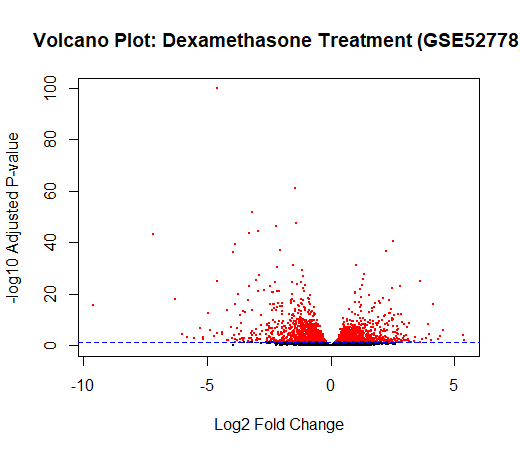
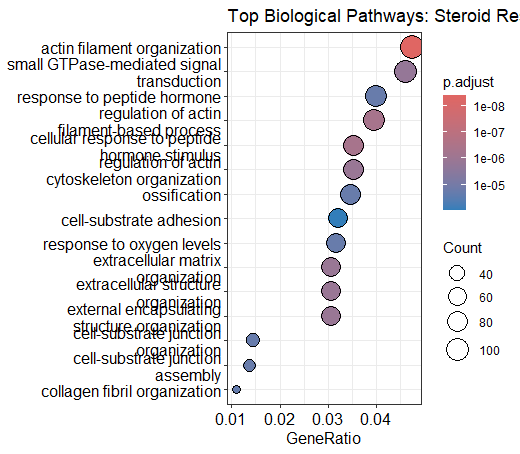
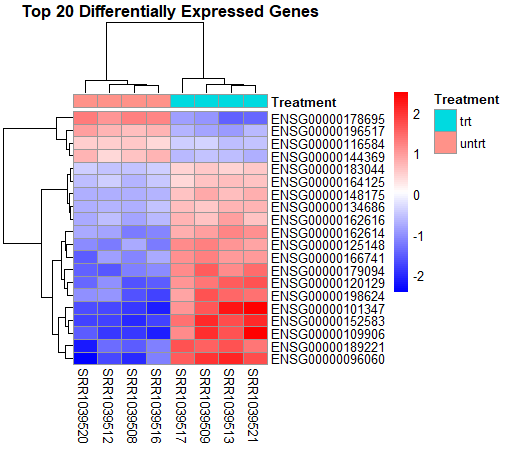

# Airway Transcriptomics: Differential Gene Expression Analysis

This project implements a complete bioinformatics pipeline for analyzing RNA-seq data from human airway smooth muscle cells treated with dexamethasone (Dataset: GSE52778).

## Project Overview
The analysis identifies genes differentially expressed in response to glucocorticoid treatment, followed by functional enrichment to determine the biological impact.

## Key Results

### 1. Differential Expression (Volcano Plot)
Statistical overview of gene up-regulation and down-regulation.

### 2. Functional Enrichment (GO Dotplot)
Identification of biological processes affected by treatment, such as inflammatory response and cell signaling.

### 3. Sample Clustering (Heatmap)
Visualizing the expression patterns of the top differentially expressed genes across samples.

